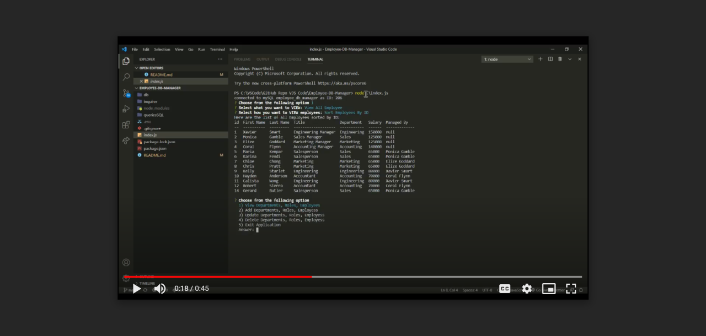
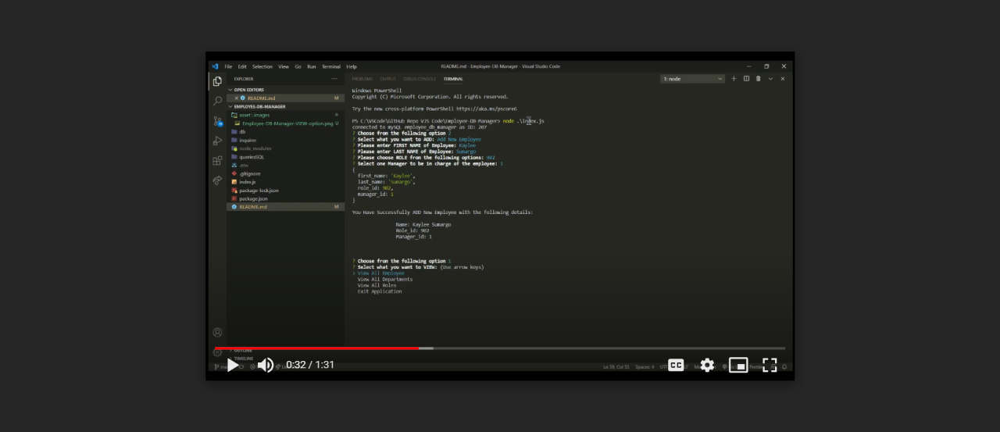
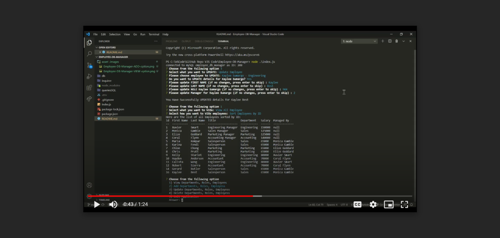
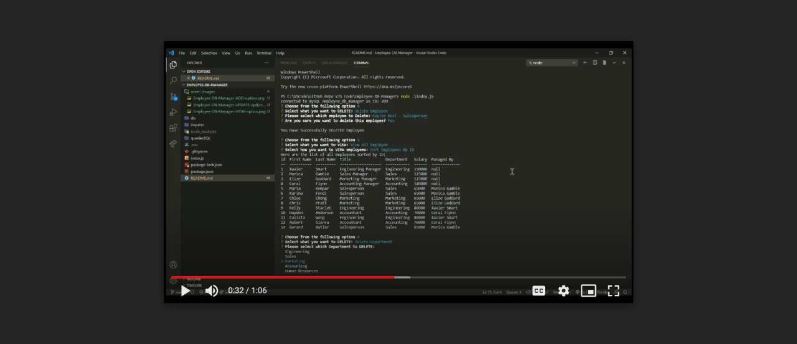

# Employee DB Manager

## Overview
---
This is a Node.JS application that takes user input from command-line to View,Add, Update or Delete from mySQL Employees Database.

## Table of Contents
---
* [Version History](#version-history)
* [Installation Methods](#installation-methods)
* [How It Works](#how-it-works)
* [Screenshoots & Video](#screenshoots-&-video)
* [Links](#links)
* [License](#license)
* [Acknowledgements](#acknowledgements)  

## Version History
---
* Version 0.0 - 22-Feb-2021
    initial working app  

## Installation Methods
---
1. Download the `package.json` and all the folders & files and store in the same folder

2. Run `npm install` to install all the required dependencies to run this app

3. Create `.env` folder in the root directory / folder where the index.js files is located, then type the following:
    ```javascript   
    mySQL_PASSWORD = // insert your own password here to connect to your mySQL workbench
    ```
    Then save the .env file

3. Run the app via terminal pointed to the root folder of the application then type: 
    ```javascript
    "node ./index.js"
    ```
* Note: must have `Node.Js` installed first in the computer  

## How It Works
---
1. After running the application via terminal command-line, follow the list of options to choose what you want to do.

2. For any default answer, just press enter without typing anything to the command-line.

3. When you have finished, choose "Exit Application" to end connection and close the app.

## Screenshoots & Video
---
1. Video of running "VIEW" options

[Link: Video of running "VIEW" options](https://drive.google.com/file/d/1U1if4VVNLurx0rqHICkK4Q9DFyLs8Dod/view)

2. Video of running "ADD" options

[Link: Video of running "ADD" options](https://drive.google.com/file/d/1zux4Y_nXR9ir7LsQ_h8EYsSPxQb0wpJ2/view)

3. Video of running "UPDATE" options

[Link: Video of running "UPDATE" options](https://drive.google.com/file/d/1Uf4Pq01TEqq7KebKZomVFAsq3C6lDrHX/view)

4. Video of running "DELETE"options

[Link: Video of running "DELETE" options](https://drive.google.com/file/d/1ZBjd-58LR2HV225lk1mDuyzv4SIBnkvn/view)

## Links
---
* [ GitHub Source Code](https://github.com/vsumargo/Employee-DB-Manager)  

## License
---
License under the MIT license  

## Acknowledgements
---
* **Trilogy Education Services & UWA Coding Bootcamp** - for design guides

* **Luca & Sam** - for their time in teaching HTML, CSS and Javascript

